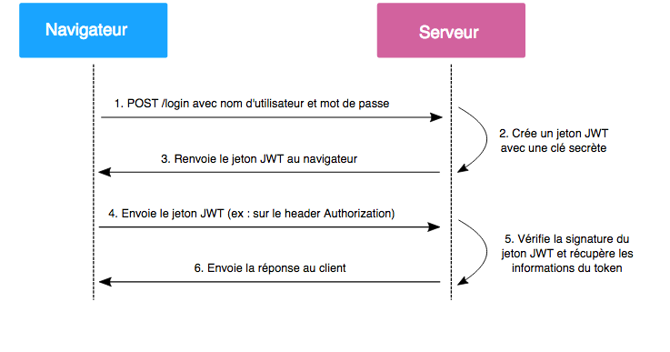

## Description des routes API

### 🔑 Authentification
| Méthode | Route                | Description                         | Authentification |
|---------|----------------------|-------------------------------------|------------------|
| **POST** | `/auth/register`      | Inscription utilisateur            | ❌               |
| **POST** | `/auth/token`         | Connexion & génération de token JWT | ❌               |
| **GET**  | `/auth/verify-email/{username}` | Vérification de l'email d'un utilisateur | ❌         |
| **PUT**  | `/auth/update_user/{username}` | Mise à jour des informations utilisateur | ✅ Token |

### 🎴 Cartes & Boosters
| Méthode | Route                        | Description                         | Authentification |
|---------|------------------------------|-------------------------------------|------------------|
| **GET**  | `/cards/`                    | Récupérer une liste de cartes       | ✅ Token         |
| **POST** | `/cards/`                    | Créer une nouvelle carte           | ✅ Token         |
| **POST** | `/booster/open_booster_and_add/` | Ouvrir un booster et ajouter des cartes | ✅ Token |
| **GET**  | `/booster/view_collections`  | Voir sa collection de cartes        | ✅ Token         |


### 🌐 Proxy
| Méthode | Route                    | Description                               | Authentification |
|---------|--------------------------|-------------------------------------------|------------------|
| **GET**  | `/proxy/proxy-image/`     | Récupérer une image depuis une URL       | ❌               |

### ⟷ Test de connexion frontend-backend
| Méthode | Route                    | Description                               | Authentification |
|---------|--------------------------|-------------------------------------------|------------------|
| **GET**  | `/api/hello/`     | Vérifie la connexion à l'API       | ❌               |


## Pour lancer le serveur Fastapi:
   ```bash
   uvicorn backend.main:app --reload
   ```

## Technologies utilisées:

🔹 **FastAPI** pour l'API comme son nom l'indique.
🔹 **PostgreSQL** pour la gestion de la base de données.
🔹 **JWT** pour l'authentification et la gestion des tokens.

# Explication du principe JWT

Les « JSON Web Token » ou JWT sont des jetons générés par un serveur lors de l’authentification d’un utilisateur sur une application Web, et qui sont ensuite transmis au client.

Ils seront renvoyés avec chaque requête HTTP au serveur, ce qui lui permettra d’identifier l’utilisateur.

Pour ce faire, les informations contenues dans le jeton sont signées à l’aide d’une clé privée détenue par le serveur. Quand il recevra à nouveau le jeton, le serveur n’aura qu’à comparer la signature envoyée par le client et celle qu’il aura générée avec sa propre clé privée et à comparer les résultats. Si les signatures sont identiques, le jeton est valide.

Cela permet notamment que ceux-ci un méchant hacker nous vole nos données il récupère seulement le tokens et non le mot de passe de notre client


